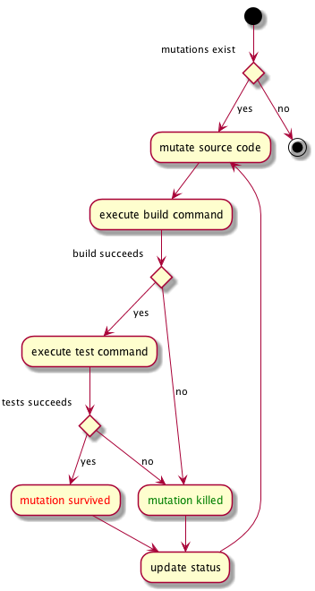
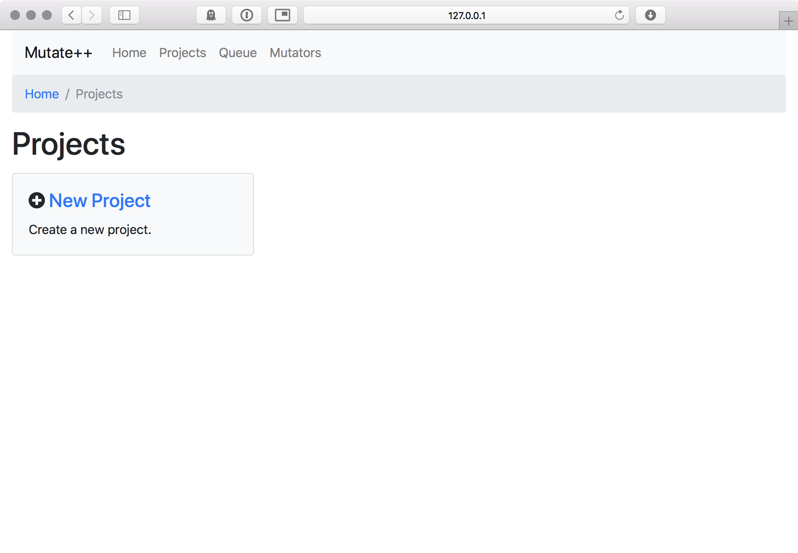
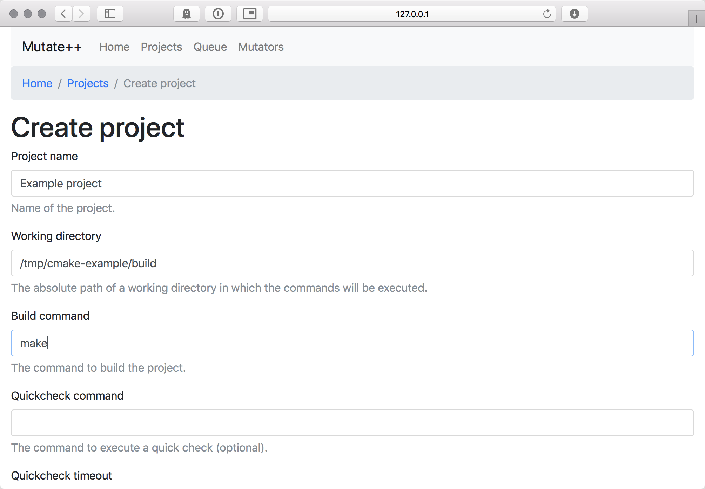
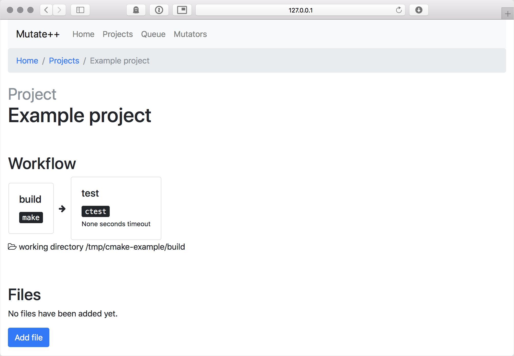
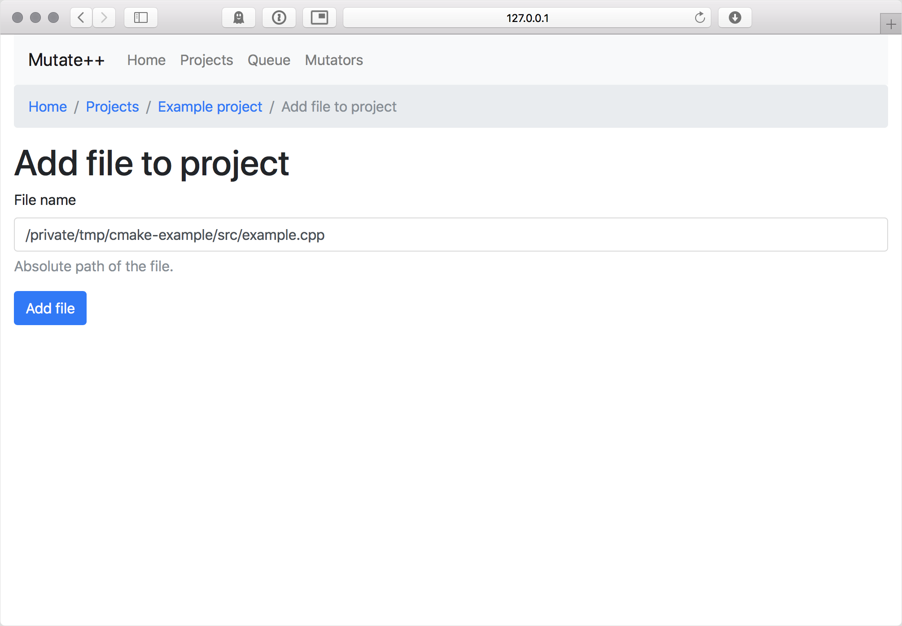
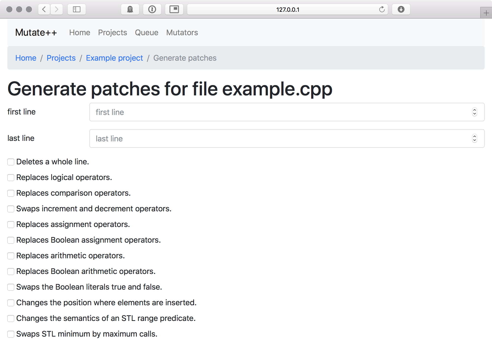
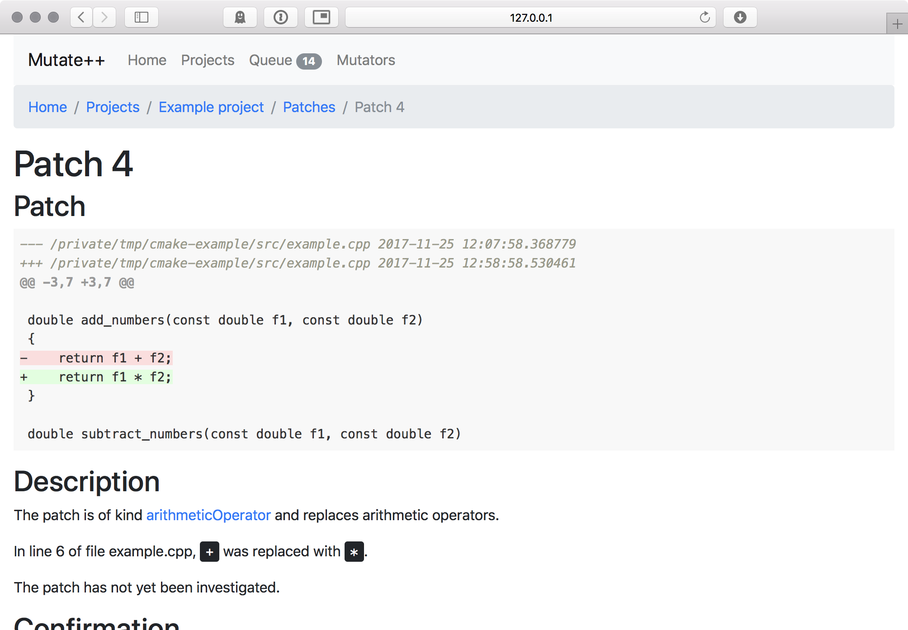
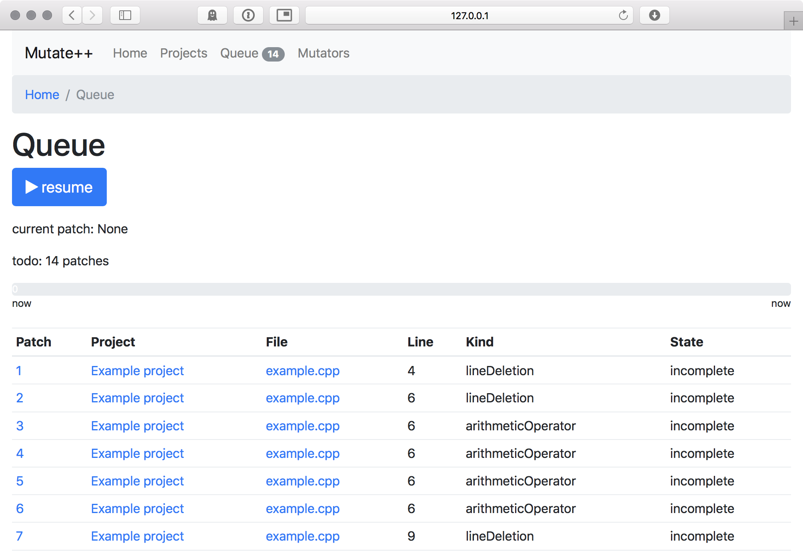
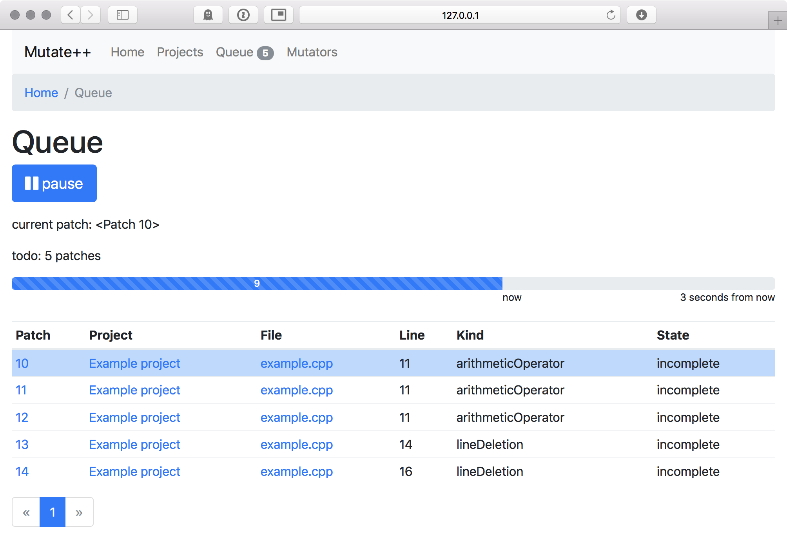
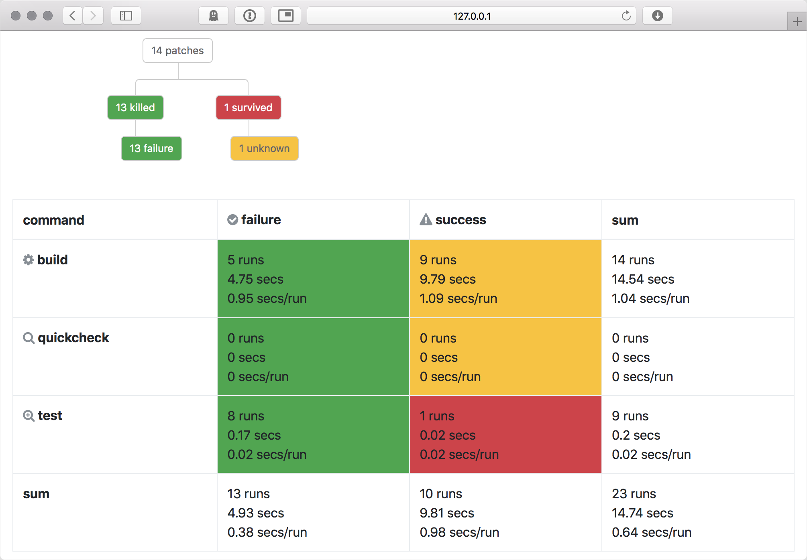

# Mutate++ - A C++ Mutation Test Environment

[Mutation testing](https://en.wikipedia.org/wiki/Mutation_testing) is a technique to detect bugs in a program by
changing its source code (called "mutation") and checking whether the program's test suite detects this mutation. The
mutations are designed to mimic typical programming errors (e.g., off-by-one errors). If such errors are not noticed
by the test suite, the "survived" mutation can be used to create an additional test that would detect it.

- [Overview](#overview)
- [Installation](#installation)
- [Example](#example)
- [Further features](#further-features)
- [Help!](#help)
- [Used third-party tools](#used-third-party-tools)
- [License](#license)


## Overview

Mutate++ is a mutation test environment for C++ programs. It supports you with the following tasks:

- create mutations of the source code
- execute the test suite for each mutation
- evaluate the outcome of the tests

Mutate++ is a web app that runs locally on your machine. All computation is locally, and no data is shared with anyone.


## Installation

You need Python 3 which can be [downloaded here](https://www.python.org/downloads/) or installed by your operating
systems's package manager.

After checking out the sources from this repository, you need to create a
[virtual environment](https://docs.python.org/3/tutorial/venv.html) and install the required packages:

```bash
virtualenv -p python3 venv
venv/bin/pip install -r requirements.txt
```

Next, we need to create a database where mutations and the results are stored:

```bash
venv/bin/python3 db_create.py
```

The database file is an SQLite3 database `app/app.db`. You can then run the app with

```bash
venv/bin/python3 run.py
```

and open it in your browser with the URL <http://127.0.0.1:5000>.


## Example

We use a small [example project](https://github.com/bast/cmake-example) to demonstrate the required steps to set up a
project in Mutate++. We assume that you have git, CMake, make, and a C++ compiler installed.


### 1. Prepare the project

Mutate++ will run the following (simplified) workflow:



We now set up the project so that we can build and test the project ourselves.

```bash
cd /tmp
git clone https://github.com/bast/cmake-example.git
cd cmake-example
mkdir build
cd build
cmake ..
```

We now have two directories we will be referring to later:

- the working directory `/tmp/cmake-example/build`: this is the directory where we will execute the build and test
  commands
- the source directory `/tmp/cmake-example/src`: this is the directory with the source code

Let's try building and testing:

```bash
cd /tmp/cmake-example/build
make
ctest
```

We see that 100% of the tests passed.

In the following, we shall refer to these commands as:

- the build command `make`: this is the command that builds the project from source
- the test command `ctest`: this is the command that executes the test suite


### 2. Create project in Mutate++



- Open <http://127.0.0.1:5000> in your browser.
- Click on ["Projects"](http://127.0.0.1:5000/projects).
- Click on ["New Project](http://127.0.0.1:5000/projects/create).
- Enter `Example project` as project name.
- Enter `/tmp/cmake-example/build` as working directory.
- Enter `make` as build command.
- Leave "Quickcheck command" and "Quickcheck timeout" empty.
- Enter `ctest` as test command.
- Leave `Test timeout` and `Clean command` empty.
- Click on "Create project".



Note that we assume the build and test command to succeed if they end with exit code `0`. This is the default for most
tools like CMake, CTest, Ninja, etc.



We are now in the [project overview](http://127.0.0.1:5000/projects/1) and see the workflow Mutate++ will execute,
consisting of the steps "build" and "test". We see that no files have been added yet, and also the patches overview is
empty.


### 3. Add a file



- Click on ["Add file"](http://127.0.0.1:5000/projects/1/files/add).
- In the "Add file to project" dialog, enter the filename `/private/tmp/cmake-example/src/example.cpp`.
- Click "Add file".

We are back in the [project overview](http://127.0.0.1:5000/projects/1), but see `example.cpp` added to the files. When
we click on [example.cpp](http://127.0.0.1:5000/projects/1/files/1), we see the source code. Go back to the
[project overview](http://127.0.0.1:5000/projects/1).


### 4. Generate patches



- Next to "example.cpp", click on ["generate patches"](http://127.0.0.1:5000/projects/1/files/1/generate).
- Leave "first line" and "last line" empty to mutate the whole file.
- Right now, none of the check boxes are actually implemented, so you can ignore all of them - all mutations will be
  used by default.
- Click on "Generate patches".

Back in the [project overview](http://127.0.0.1:5000/projects/1), you see that 14 patches have been generated. You can
inspect them back clicking on ["14 patches"](http://127.0.0.1:5000/projects/1/patches) in the "Patches" section. In
this overview, you see the individual patches with their line, kind, state and confirmation:

- The kind describes the nature of the patch, e.g. "lineDeletion" or "arithmeticOperator". If you click on a kind, the
  list of patches will be filtered accordingly.
- The state describes whether the patch was analyzed so far; that is, whether the code has been mutated accordingly and
  the test suite has been executed. So far, all patches are incomplete.
- The confirmation describes whether you have been evaluated the results so far. All patches are "unknown" so far.



Let's now click on ["4"](http://127.0.0.1:5000/projects/1/patches/4) to have a look at the details of a patch:

- In the top, you see the actual patch: We see that the patch replaces `return f1 + f2;` by `return f1 * f2;`.
- The description provides a summary of the patch.
- You could set the confirmation, but this would not make sense as we have not executed the patch so far.
- Finally, we see that no runs have been executed so far.

Go back to the [project overview](http://127.0.0.1:5000/projects/1).


### 5. Execute patches



Now it is time to actually apply the patches:

- In the top navigation, click on ["Queue"](http://127.0.0.1:5000/queue). We see the 14 patches from before.
- Click on ["Resume"](http://127.0.0.1:5000/queue/start) to start the execution.
- When you reload the page, you see that after a few seconds, the queue is empty.



What happened? Mutate++ executed the workflow described above for each patch. That is, it applied the patch to the
source file `/private/tmp/cmake-example/src/example.cpp`, executed the build command `make` in the working directory
`/tmp/cmake-example/build`, and then executed the test command `ctest` in the same directory. As we have a trivial
project with just 14 patches, this is just a matter of seconds.

Go back to the [project overview](http://127.0.0.1:5000/projects/1) by clicking on
["Projects"](http://127.0.0.1:5000/projects) and ["Example project"](http://127.0.0.1:5000/projects/1).


### 6. Evaluate results



The Patches second got more colorful now. We see a graph that describes the breakdown of the patches:

- 14 patches were generated in total.
- 13 patches were killed; meaning they have been detected by the test suite or the code did not compile.
- 13 of these patches were killed due to a failure. There are other reasons a patch could have been killed which we
  describe later.
- 1 patch survived, meaning the mutated source code could be compiled and tested without problems.

Let's investigate this by clicking on ["1 survived"](http://127.0.0.1:5000/projects/1/patches?patch_state=survived) to
see the list of survived patches. We see that patch 14 survived. Click on
["14"](http://127.0.0.1:5000/projects/1/patches/14).

In the patch overview, we see what happened:

- The patch deleted line 16 of file `/private/tmp/cmake-example/src/example.cpp`, resulting in function
  `multiply_numbers` not returning anything.
- In the run overview, we see the individual steps of the workflow:
  - [Run 22](http://127.0.0.1:5000/projects/1/patches/14/runs/22) shows the output of the build command. Maybe some
    stricter compiler settings could have warned about the mutation, but instead the code was built successfully.
  - [Run 23](http://127.0.0.1:5000/projects/1/patches/14/runs/23) shows that also the test suite was executed
    successfully.

Why is this an issue? Because no one noticed that we deleted the multiplication! The easiest way to fix this is by
adding a respective test case. In larger projects, we do not want to switch back and forth between evaluating patches
and fixing the test suite, so we set the patch "confirm" and press "Submit".

In some cases, the patch would change the source code in ways that it is natural that the test suite would not
detect it, e.g. in parts of the code that are skipped by preprocessor directives (e.g. with `#ifdef` commands) or when,
the patch results in equivalent code. In that cases, set the patch to "ignore".

Later, you can filter to show only the
[confirmed](http://127.0.0.1:5000/projects/1/patches?patch_state=survived&confirmation_state=confirmed) patches and
adjust your test suite accordingly.

In the [project overview](http://127.0.0.1:5000/projects/1), you also get some statistics on the execution: We see that
5 patches failed during the build, whereas 9 built successfully. From these 9, 8 failed the tests, and
[1 patch](http://127.0.0.1:5000/projects/1/patches/14) succeeded.


## Further features

- **Timeouts**. Mutating the code can create infinite loops. Therefore, it is wise to set a timeout for the tests in
  the "Create Project" dialog. Tests that take longer than this timeout are treated as if the test failed.
- **Quickchecks**. A lot of test suites can be split into tests that run very quickly and the full test suite which
  may take many minutes to execute. In the "Create Project" dialog, you can define a "Quickcheck command" to execute
  this quicker test suite first. A lot of patches may be detected quicker this way.
- **Cleaning up**. Some test suites may required cleaning up afterward. You can provide a "Clean command" in the
  "Create Project" dialog. It will be executed after processing each patch. Note that the example project implements
  a `make clean` command, but adding this as clean command would only increase the build times, because all source
  files would be re-compiled even if only one was changed.
- **Hashing binaries**. Optimizing compilers may create exactly the same binary for programs that differ syntactically,
  but have the same semantics. Therefore, it can be helpful to calculate a hash of the generated binaries and compare
  it to reference values. If the hashes are the same, then you know the test suite will create the same result. To
  avoid waiting for such a false positive, Mutate++ can stop the evaluation of such patches if the test command or
  quickcheck command return exit code `77`.


## Help!

Mutate++ is in a very early stage, and there is a lot to do. In particular, we are aware of severe limitations:

- Mutations are created very naively on a purely syntactical level and often result in code that fails compilation.
  Using, for instance, LLVM-based tools could help to use more type information to create mutations which are more
  likely to result in valid C++ programs.
- The web app has a terrible UX, and should be overworked by someone who knows more about this...

That said, pull requests and issues are more than welcome!


## Used third-party tools

Mutate++ contains the following libraries for the frontend:

- [Bootstrap](http://getbootstrap.com) for the frontend components
- [Font Awesome](http://fontawesome.io) for the icons
- [highlight.js](https://highlightjs.org) for source code syntax highlighting
- [jQuery](https://jquery.com) for some custom JavaScript code

The web app uses [Flask](http://flask.pocoo.org) and [SQLAlchemy](https://www.sqlalchemy.org), and a lot of
[other packages](requirements.txt).


## License


Mutate++ is licensed under the [MIT License](http://opensource.org/licenses/MIT):

Copyright &copy; 2017 [Niels Lohmann](http://nlohmann.me)

Permission is hereby granted, free of charge, to any person obtaining a copy of this software and associated
documentation files (the “Software”), to deal in the Software without restriction, including without limitation the
rights to use, copy, modify, merge, publish, distribute, sublicense, and/or sell copies of the Software, and to permit
persons to whom the Software is furnished to do so, subject to the following conditions:

The above copyright notice and this permission notice shall be included in all copies or substantial portions of the
Software.

THE SOFTWARE IS PROVIDED “AS IS”, WITHOUT WARRANTY OF ANY KIND, EXPRESS OR IMPLIED, INCLUDING BUT NOT LIMITED TO THE
WARRANTIES OF MERCHANTABILITY, FITNESS FOR A PARTICULAR PURPOSE AND NONINFRINGEMENT. IN NO EVENT SHALL THE AUTHORS OR
COPYRIGHT HOLDERS BE LIABLE FOR ANY CLAIM, DAMAGES OR OTHER LIABILITY, WHETHER IN AN ACTION OF CONTRACT, TORT OR
OTHERWISE, ARISING FROM, OUT OF OR IN CONNECTION WITH THE SOFTWARE OR THE USE OR OTHER DEALINGS IN THE SOFTWARE.
